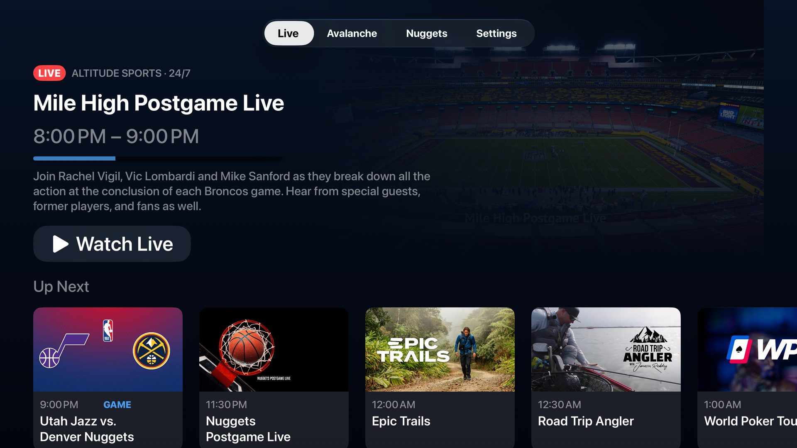
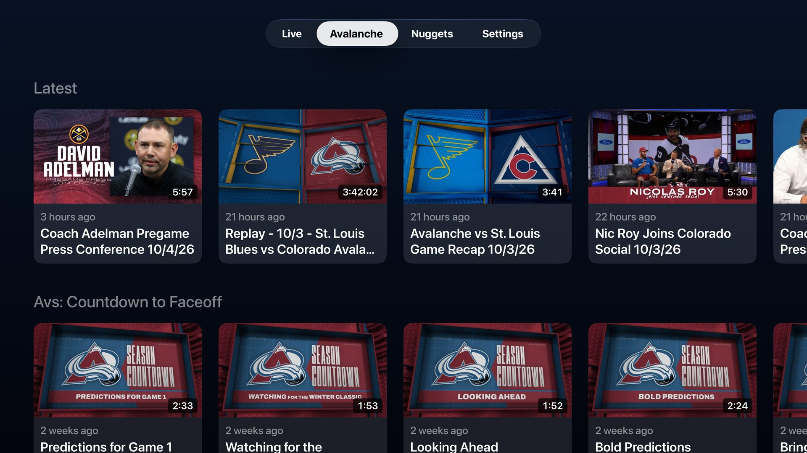

# Altitude++ for Apple TV

An unofficial Apple TV app for [Altitude+](https://www.altitudeplus.com), the streaming service for Altitude Sports in Colorado. It opens straight to the 24/7 channel and keeps Avalanche and Nuggets replays, postgame shows, and highlights a click away.




> **Unofficial.** Altitude++ isn't affiliated with or endorsed by Altitude Sports & Entertainment, Kroenke Sports & Entertainment, or ViewLift. You need your own Altitude+ subscription and must be inside Altitude's broadcast territory. **No encryption is bypassed:** streams play through Apple's FairPlay, the same way the official apps play them, and Altitude++ doesn't record, download, or share anything. It may stop working if Altitude+ changes its service. The code is [MIT-licensed](../LICENSE); Altitude's and the teams' names, logos, and artwork (including the app icon and screenshots) belong to their owners. See [License and trademarks](../README.md#license-and-trademarks).

## Features

- **Opens to the live channel.** The 24/7 feed starts as soon as the app launches (you can turn that off). Pause and rewind work within the live window.
- **Now and Up Next** from the channel guide, on the Live tab and in the player's swipe-down info panel.
- **Avalanche and Nuggets tabs** with the rows from each team's page on altitudeplus.com: game replays, postgame shows, gameday features, news, and recaps. Choose which team comes first in Settings.
- **Easy sign-in.** Enter your email and the 6-digit code Altitude+ sends you. There's no password to type with the remote.
- **Location** comes from the Apple TV for Altitude's territory check, with your IP address as the fallback.

## What you need

- An **Altitude+ subscription** and a location inside Altitude's broadcast territory.
- An **Apple TV** (HD or 4K) running tvOS 17 or later.
- A **Mac** with [Xcode](https://apps.apple.com/app/xcode/id497799835) and [Homebrew](https://brew.sh). Developed and tested with Xcode 27 (beta).
- An **Apple ID**. A free one works, but Apple only signs apps from free accounts for 7 days, so you'll reinstall weekly. A paid [Apple Developer](https://developer.apple.com/programs/) membership signs for a year.

## Install on your Apple TV

1. **Get the code** and open Terminal in the `appletv` folder:

   ```sh
   git clone https://github.com/eastofeaston/altitudeplusplus.git
   cd altitudeplusplus/appletv
   ```

   (Or download the ZIP from GitHub and `cd` into its `appletv` folder.)

2. **Install XcodeGen**, which builds the Xcode project:

   ```sh
   brew install xcodegen
   ```

3. **Sign in to Xcode** with your Apple ID: open Xcode, go to **Xcode → Settings → Accounts**, click **+**, and sign in.

4. **Pair your Apple TV with your Mac** (one time):
   1. Make sure the Apple TV and the Mac are on the same network.
   2. On the Apple TV, open **Settings → Remotes and Devices → Remote App and Devices** and stay on that screen.
   3. On the Mac, open **Xcode → Window → Devices and Simulators**. Select your Apple TV under *Discovered*, click **Pair**, and enter the code shown on the TV.

5. **Run the installer:**

   ```sh
   tools/install-tv.sh
   ```

   The first run saves your Apple team in `Config/Local.xcconfig`. If you have more than one team, or more than one Apple TV paired, it asks which to use. When it finishes, it tells you how long the install is signed for:

   ```
   Installed Altitude++ on Den.
   Signed until Sun Oct 11 at 7:35 PM. Free Apple accounts sign apps for 7 days; run this again after that to renew.
   ```

6. **Open Altitude++** from the Apple TV home screen.

### Renewing

With a free Apple ID, the app stops opening once its signing expires. Run `tools/install-tv.sh` again after that. Your sign-in and settings are kept. Running it before the expiry updates the app but doesn't extend the date.

### Installer options

```sh
tools/install-tv.sh "Bedroom"            # install on the Apple TV with that name
tools/install-tv.sh --launch             # open the app on the TV when it's done
tools/install-tv.sh --list               # show paired Apple TVs and your Apple teams
tools/install-tv.sh --team ABCDE12345    # sign with a different Apple team
```

## Using it

**First launch:** enter the email on your Altitude+ account, then the 6-digit code from the email Altitude+ sends. (An iPhone nearby can type for you.) Allow location access when asked. The live channel starts; press **Back** (or **Menu**) on the remote to get to the tabs.

**Tabs:** **Live**, then the two teams, then **Settings**.

**Settings:**

- **Team Order:** which team's tab comes first.
- **Location:** whether location access is allowed, the ZIP code Altitude+ is using, and a button to refresh it.
- **Start Live on Launch:** turn off to land on the Live tab instead of the player.
- **Device Profile:** leave on *Apple TV* unless streams won't start (see below).
- **Diagnostics:** a one-button access test and the last response from Altitude+, with tokens shortened.

## Troubleshooting

| Problem | What to try |
|---|---|
| "doesn't have an active Altitude+ subscription" | Check your subscription on altitudeplus.com, and that you signed in with the same email. |
| "outside its viewing territory" | Check **Settings → Location → Implied ZIP Code**. If it's wrong, allow location access and choose **Refresh Location**. |
| Video won't start, or a license error | Try **Settings → Diagnostics → Test Live Channel Access**. Then try **Device Profile → Web browser**. |
| The app won't open after about a week | The free signing expired. Run `tools/install-tv.sh` again. |
| Installer: "no Apple TV is paired" | Follow the pairing steps above. The Apple TV must be awake and on the same network. |
| Installer: "Xcode isn't signed in" | Add your Apple ID in **Xcode → Settings → Accounts**. |
| Installer: build or signing errors | Run `xcodegen generate`, open `AltitudePlusPlus.xcodeproj`, and look at the AltitudePlusPlus target's **Signing & Capabilities** tab, which explains signing problems more clearly. If the Apple TV asks for **Developer Mode**, turn it on in the Apple TV's Settings and restart it. |

## Trying it in the Simulator

From the `appletv` folder:

```sh
xcodegen generate
open AltitudePlusPlus.xcodeproj
```

Choose an Apple TV simulator and press ⌘R. Sign-in, the guide, and the team tabs all work, and short clips play. The live channel and full replays use FairPlay, which only works on a real Apple TV, so the Simulator shows a message instead.

## For developers

See [DEVELOPMENT.md](DEVELOPMENT.md) for the project layout, signing, debug options, and UI tests, and [docs/API.md](../docs/API.md) for how Altitude+ works.
